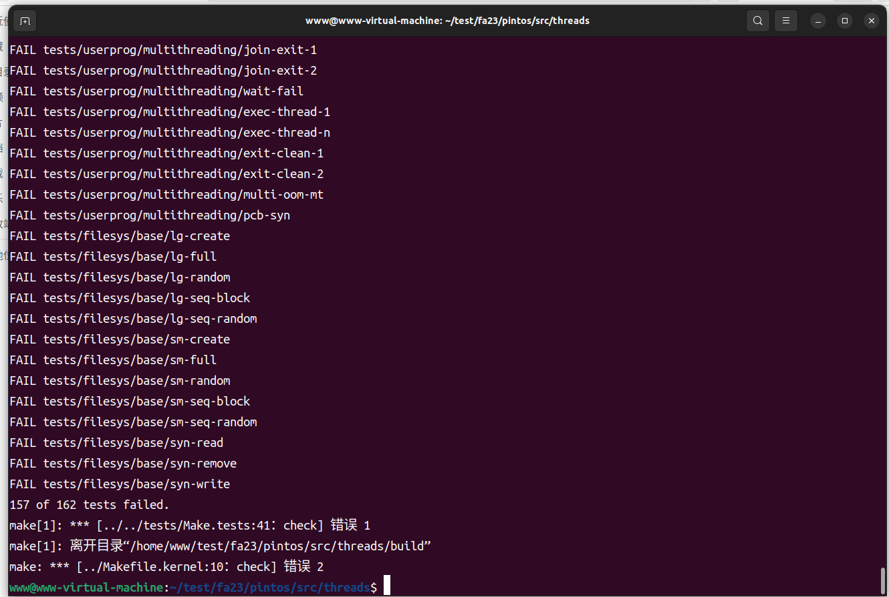
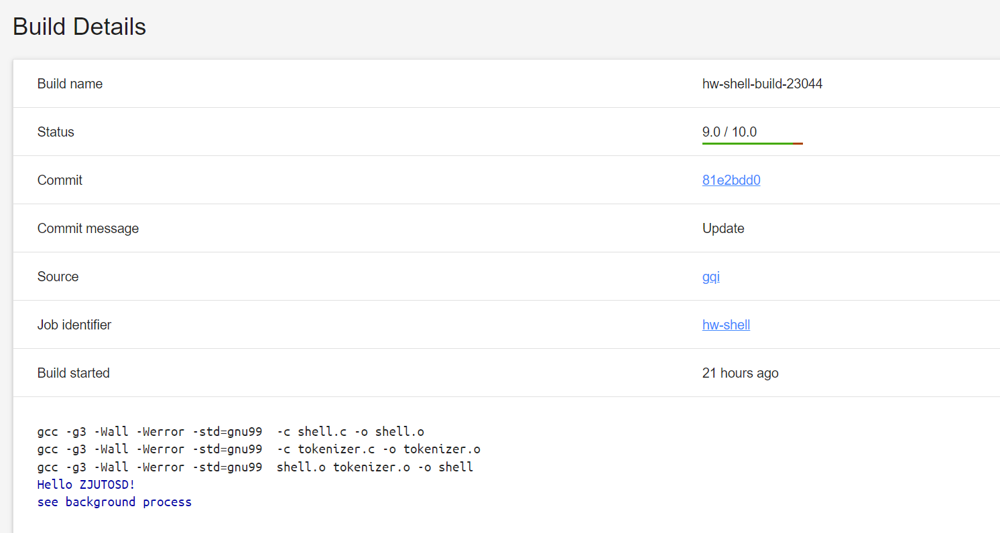

# 操作系统课程设计实验报告

## **实验一 准备开发工具【Pintos Introduction】**

安装C语言开发环境、掌握`git`等网络工程工具的使用

### 一. 主要任务

阅读和分析Linux下的`gcc/make/gdb`等开发工具的使用文档，在自己的机器上配置好C语言开发环境。安装好git客户端工具，注册`gitlab`账号，构建连续集成和连续交付(CI/CD)环境。

重点检查编码、调试、提交等环节的熟练程度。

### 二. 实验过程

1.  **克隆初始仓库**： 首先，通过执行 `git clone` 命令从 Pintos 的初始仓库中克隆代码到本地计算机。这一步骤通常可以通过以下命令完成：
    
    ```
    git clone https://gitlab.etao.net/zjutosd/fa23
    ```
    
2.  克隆完成后，我们将获得 Pintos 源代码的本地副本，可以在本地进行修改和构建。
    
3.  **安装依赖**： 在克隆 Pintos 代码之后，需要安装一系列依赖项，以确保能够成功构建和运行 Pintos。这些依赖项通常包括：
    
    - Git：用于版本控制和管理 Pintos 代码。
    - Clang：用于编译 Pintos 代码，生成可执行文件。
    - QEMU：用于模拟运行操作系统，可以在其中测试和调试 Pintos。
4.  **配置环境**： 在安装依赖项之后，需要对环境进行一些配置，以确保能够顺利构建和运行 Pintos。这些配置通常包括：
    
    - 设置环境变量：将安装的软件路径添加到系统的 PATH 环境变量中，以便系统可以找到相应的可执行文件。
    - 检查版本兼容性：确保安装的软件版本与 Pintos 的要求兼容，特别是对于 Clang 和 QEMU。
5.  **构建项目**： 在配置好环境之后，就可以使用提供的构建脚本或命令来构建 Pintos 项目。通常，构建过程包括以下步骤：
    
    - 使用提供的构建工具或 Makefile 来编译源代码。
    - 检查编译过程中是否有错误或警告，并及时修复。
    - 生成可执行文件或镜像文件，以便在模拟器中进行测试和调试。
6.  **测试和调试**： 构建完成后，可以使用 QEMU 模拟器来运行 Pintos，并进行测试和调试。在模拟器中，可以模拟各种场景和操作系统行为，以验证 Pintos 的正确性和稳定性。同时，还可以使用调试工具来定位和解决可能存在的问题。
    

### 三. 实验结果

由于并没有对代码进行改动，所以，大部分测试点都是failed。



* * *

## **实验二 简单Shell实现**

### 一. 主要任务

设计和实现一个模拟Bash 的shell实现，要求支持`cd`和`pwd`命令，支持程序执行、路径解析、输入/输出的重定向，信号(Signal)处理等功能。

我们添加了两个内置命令：`cd` 和 `pwd`。`cd` 命令用于改变当前工作目录，而 `pwd` 命令则用于打印当前工作目录。

### 二. 代码修改

1.  **添加了执行配置结构体 `Configuration`**：
    
- 新增了一个结构体 `Configuration`，用于保存执行命令时的参数、重定向信息和管道信息等。
 - 结构体包含了命令的参数列表 `arglist`、输入输出重定向相关信息以及管道相关信息。

```
    typedef struct Configuration {
        //arglist
        char **arglist;

        //redirection
        int redirection;
        int read_file_fd;
        char *read_file_path;
        int write_file_fd;
        char *write_file_path;
        //pipe
        int **pipe;
        int pipe_num, cur_num;
    } Config;
```

2.  **新增了内置命令 `cd` 和 `pwd`**：
    
- 添加了内置命令 `cd`，用于切换工作目录。

```
    int cmd_cd(unused struct tokens *tokens) {
        const char HOME_PATH[] = "/home/vagrant";
        if (tokens_get_length(tokens) == 1) {
            chdir(HOME_PATH);
        } else if (tokens_get_length(tokens) == 2 && strcmp(tokens_get_token(tokens, 1), "~") == 0) {
            chdir(HOME_PATH);
        } else {
            int failed = chdir(tokens_get_token(tokens, 1));
            if (failed) {
                printf("error\n");
            }
        }
        return 1;
    }
```

- 添加了内置命令 `pwd`，用于打印当前工作目录的路径。

```
    int cmd_pwd(unused struct tokens *tokens) {
        char *buffs = getcwd(NULL, 0);
        printf("%s\n", buffs);
        free(buffs);
        return 1;
    }
```

3.  **新增了程序执行函数 `run_program`**：
    
 - 添加了一个新的函数 `run_program`，用于执行用户输入的命令。
 - 函数根据用户输入的命令参数，执行对应的程序或命令，并支持输入输出重定向和后台运行等功能。

```
	int run_program(struct tokens* tokens) {
		int length = tokens_get_length(tokens);
		if (length == 0) {
			// user pressed return
			return 0;
		}
		int run_bg = length > 1 && strcmp(tokens_get_token(tokens, length - 1), "&") == 0;
		int pid = fork();
		int status = 0;
		if (pid == 0) {
			char* args[length + 1];
			int redirect_stdin = 0, redirect_stdout = 0, num_args = 0;
			for (int i = 0; i < length; i++) {
				char* token = tokens_get_token(tokens, i);
				if (redirect_stdin) {
					int fd = open(token, O_RDONLY);
					if (redirect(fd, STDIN_FILENO) == -1) {
						printf("Error with input %s \n", token);
						exit(-1);
					}
					redirect_stdin = 0;
				}
				else if (redirect_stdout) {
					int fd = creat(token, S_IRUSR | S_IWUSR | S_IRGRP | S_IWGRP | S_IROTH);
					if (redirect(fd, STDOUT_FILENO) == -1) {
						printf("Error with input %s\n", token);
						exit(-1);
					}
					redirect_stdout = 0;
				}
				else if (strcmp(token, "<") == 0) {
					redirect_stdin = 1;
				}
				else if (strcmp(token, ">") == 0) {
					redirect_stdout = 1;
				}
				else if (!(i == length - 1 && run_bg)) {
					args[num_args++] = token;
				}
			}
			args[num_args] = (char*)NULL;
			char* prog = args[0];

			// move process to own process group
			setpgid(0, 0);
			if (!run_bg) {
				// move to foreground if input doesn't end with &
				tcsetpgrp(shell_terminal, getpgrp());
			}

			//override ignored signal handlers from shell to default signal handlers
			for (int i = 0; i < sizeof(ignore_signals) / sizeof(int); i++) {
				signal(ignore_signals[i], SIG_DFL);
			}

			// execute new program in child process, searching thru path env var if needed
			if (execv(prog, args) == -1 && run_program_thru_path(prog, args) == -1) {
				printf("Error executing program %s\n", prog);
				exit(-1);
			}
		}
		else {
			int no_hang = run_bg ? WNOHANG : 0;
			waitpid(pid, &status, WUNTRACED | no_hang);
			tcsetpgrp(shell_terminal, shell_pgid);
		}
		return status;
	}
```

### 三. 实验结果

实验代码通过了大部分测试样例。



## **实验四** **Pintos用户程序【Pintos** Project 2: User Programs **】**

### 一. 主要内容

阅读分析Pintos源码，实现User Program部分的以下功能：

1. Argument Passing 参数传递

2. Process Control Syscalls 进程控制系统调用

3. File Operating Syscalls 文件操作系统调用

### 二. 代码修改

#### 1. Argument Passing 参数传递

主要创建了两个函数，其中 `process_execute` 函数用于创建新的进程并执行指定的程序文件，而 `start_process` 函数则负责实际的进程初始化和加载可执行文件。

- `process_execute` 函数：

复制文件名：首先，该函数会创建一个文件名的副本，以避免与加载函数之间的竞争条件。

创建线程节点：然后，创建一个线程节点 `thread_node`，用于管理新创建的线程的相关信息，如父线程ID、加载状态等。

初始化线程节点：初始化线程节点的各个字段，如父线程ID、加载状态等，并将其添加到全局线程节点列表中。

创建新线程：调用 `thread_create` 函数创建新的线程，并传入程序文件名副本及其他参数。
等待加载完成：等待新线程加载程序文件完成，并根据加载状态决定返回结果。

```
	pid_t process_execute(const char* file_name) {
	  char* fn_copy;
	  tid_t tid;

	  /* Make a copy of FILE_NAME.
		 Otherwise there's a race between the caller and load(). */
	  fn_copy = palloc_get_page(0);
	  if (fn_copy == NULL)
		return TID_ERROR;
	  strlcpy(fn_copy, file_name, PGSIZE);

	  struct thread_node* thread_node = malloc(sizeof(struct thread_node));
	  thread_node->exit_status = -1;
	  thread_node->already_wait = false;
	  if (thread_current()->pcb == NULL || thread_current()->pcb->main_thread == NULL)
		thread_node->p_pid = thread_current()->tid;
	  else
		thread_node->p_pid = thread_current()->pcb->main_thread->tid;
	  thread_node->load_success = false;
	  sema_init(&thread_node->semaph, 0);
	  sema_init(&thread_node->load_semaph, 0);
	  lock_acquire(&thread_lock);
	  list_push_back(&thread_nodes_list, &thread_node->elem);
	  lock_release(&thread_lock);


	  /* Create a new thread to execute FILE_NAME. */
	 thread_node->tid = tid = thread_create(file_name, PRI_DEFAULT, start_process, fn_copy);
	  if (tid == TID_ERROR)
		palloc_free_page(fn_copy);

	  sema_down(&thread_node->load_semaph);
	  if (!thread_node->load_success)
		return TID_ERROR;
	  return tid;
	}
```

- `start_process` 函数：

该函数的主要功能包括：

分配进程控制块（PCB）：首先，为新的进程分配进程控制块，用于管理进程的各项资源和状态。

初始化 PCB：初始化 PCB 的各项字段，如页表、文件列表、信号量等。
加载可执行文件：调用 load 函数加载可执行文件，并将用户栈顶指针初始化为新进程的用户栈顶。

处理加载结果：根据加载结果更新线程节点的加载状态，并释放不再需要的资源。

参数传递：将程序文件名及其他参数压入用户栈中，以便新进程访问。

启动用户进程：通过模拟中断返回的方式启动用户进程执行。

```
	static void start_process(void* file_name_) {
	  char* file_name = (char*)file_name_;
	  struct thread* t = thread_current();
	  char* argv0 = get_argv0(file_name);

	  struct intr_frame if_;
	  bool success, pcb_success;

	  /* Allocate process control block */
	  struct process* new_pcb = malloc(sizeof(struct process));
	  success = pcb_success = new_pcb != NULL;

	  /* Initialize process control block */
	  if (success) {
		// Ensure that timer_interrupt() -> schedule() -> process_activate()
		// does not try to activate our uninitialized pagedir
		new_pcb->pagedir = NULL;
		t->pcb = new_pcb;

		list_init(&new_pcb->all_files_list);
		lock_init(&new_pcb->file_list_lock);
		new_pcb->next_fd = 2;

		list_init(&new_pcb->all_threads);
		sema_init(&new_pcb->semaph, 0);

		list_init(&new_pcb->user_lock_list);
		new_pcb->next_lock_id = 1;
		list_init(&new_pcb->user_semaphore_list);
		new_pcb->next_semaphore_id = 1;

		 // Continue initializing the PCB as normal
		new_pcb->main_thread = t;
		strlcpy(new_pcb->process_name, argv0, sizeof(new_pcb->process_name));
	  }
	struct thread_node* node = get_thread_node(t->tid);
	  /* Initialize interrupt frame and load executable. */
	  if (success) {
		memset(&if_, 0, sizeof if_);
		if_.gs = if_.fs = if_.es = if_.ds = if_.ss = SEL_UDSEG;
		if_.cs = SEL_UCSEG;
		if_.eflags = FLAG_IF | FLAG_MBS;
		node->load_success = success = load(argv0, &if_.eip, &if_.esp);
	  }
	 sema_up(&node->load_semaph);
	  /* Handle failure with succesful PCB malloc. Must free the PCB */
	  if (!success && pcb_success) {
		// Avoid race where PCB is freed before t->pcb is set to NULL
		// If this happens, then an unfortuantely timed timer interrupt
		// can try to activate the pagedir, but it is now freed memory
		struct process* pcb_to_free = t->pcb;
		t->pcb = NULL;
		free(pcb_to_free);
	  }

	if (success) {
		args_push_stack(file_name, &if_.esp);
		free(argv0);
	  }
	  /* Clean up. Exit on failure or jump to userspace */
	  palloc_free_page(file_name);
	  if (!success) {
		thread_exit();
	  }

	  /* Start the user process by simulating a return from an
		 interrupt, implemented by intr_exit (in
		 threads/intr-stubs.S).  Because intr_exit takes all of its
		 arguments on the stack in the form of a `struct intr_frame',
		 we just point the stack pointer (%esp) to our stack frame
		 and jump to it. */
	  asm("fsave (%0)" : : "g"(&if_.fp_regs)); // fill in the frame with current FP registers
	  asm volatile("movl %0, %%esp; jmp intr_exit" : : "g"(&if_) : "memory");
	  NOT_REACHED();
	}
```

这两个函数共同实现了参数传递功能，使得新创建的进程能够正确地加载并执行指定的程序文件，并能够访问到传入的参数。

#### 2. 系统调用

实现了用户程序与操作系统之间的系统调用接口，提供了一组系统调用函数，用于执行各种操作系统功能。以下是各个系统调用函数的功能说明：

`syscall_init(void)`：初始化系统调用，注册系统调用处理程序 syscall_handler。

`syscall_handler(struct intr_frame*)`：系统调用处理程序，根据传入的系统调用号，调用相应的系统调用函数。

`is_validity(struct intr_frame*, void*)`：检查给定地址是否有效，如果地址无效，则终止当前线程。

`syscall_exit(struct intr_frame*, int)`：退出当前线程，设置退出状态，并打印退出信息。

`syscall_exec(struct intr_frame*, const char*)`：执行新程序，创建新进程，并返回其PID。

`syscall_create(struct intr_frame*, const char*, unsigned)`：创建文件，指定文件名和初始大小。

`syscall_remove(struct intr_frame*, const char*)`：删除文件，指定文件名。

`syscall_open(struct intr_frame*, const char*)`：打开文件，指定文件名。

`syscall_file_size(struct intr_frame*, int)`：获取文件大小，通过文件描述符指定文件。
`syscall_read(int, void*, unsigned)`：从文件或输入设备读取数据。

`syscall_write(int, const void*, unsigned)`：向文件或输出设备写入数据。

`syscall_seek(struct intr_frame*, int, unsigned)`：设置文件指针位置。

`syscall_tell(struct intr_frame*, int)`：获取文件指针位置。

`syscall_close(struct intr_frame*, int)`：关闭文件，通过文件描述符指定文件。
### 三. 实验结果

实验代码通过了大部分测试样例。


* * *

## **实验总结**

**1. 对专业知识基本概念、基本理论和典型方法的理解：**

在进行实验过程中，对于所涉及的专业领域的基本概念、理论和方法需要有一定的理解。这包括对于操作系统、编程语言、数据结构与算法等方面的基本概念的理解，以及对于实验所涉及的具体技术和工具的使用方法的了解。

**2. 怎么建立模型：**

在实验中，建立模型是解决问题的第一步。建立模型涉及到对问题进行抽象和简化，确定问题的关键因素和变量，并将其表示为数学模型、逻辑模型或者计算机模型等形式。建立模型的过程需要考虑到问题的实际情况和所需求解的精度，同时也需要考虑到建模的复杂程度和可行性。

**3. 如何利用基本原理解决复杂工程问题：**

解决复杂工程问题需要运用基本原理和方法，例如通过分析问题的本质和特点，运用已有的理论知识和方法进行分析和求解。同时，还需要结合实际情况和工程实践经验，灵活运用各种工具和技术，找到问题的最优解决方案。

**4. 具有实验方案设计的能力：**

设计实验方案是解决问题的关键步骤之一。具有实验方案设计的能力需要综合考虑问题的背景、目的和要求，确定实验的目标和内容，选择合适的实验方法和工具，设计实验步骤和流程，并对实验结果进行评估和分析。一个好的实验方案能够确保实验的顺利进行和取得有效的结果。

**5. 如何对环境和社会的可持续发展：**

在进行工程实践和解决问题的过程中，需要考虑到对环境和社会的可持续发展。这包括对资源的合理利用和节约、对环境的保护和治理、对社会的责任和贡献等方面的考虑。在设计实验方案和解决工程问题时，应该注重环境友好性和社会责任，尽量减少对环境的影响，促进社会的和谐发展。


