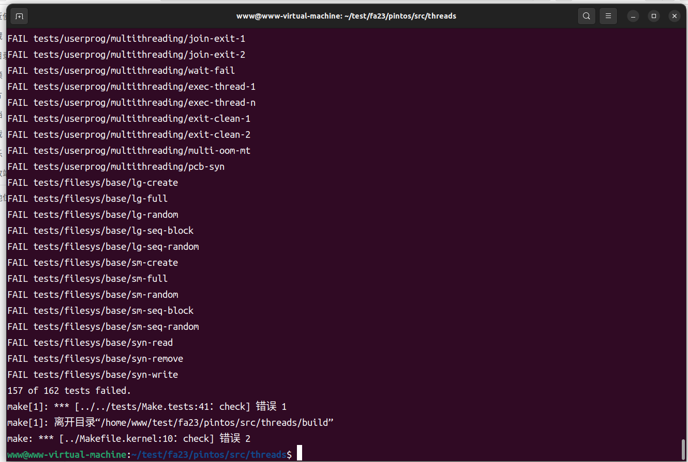
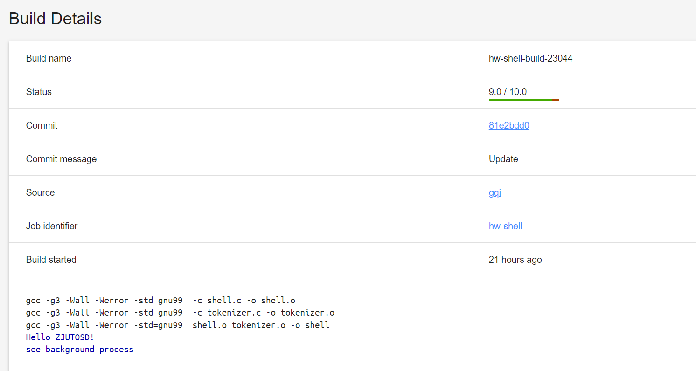
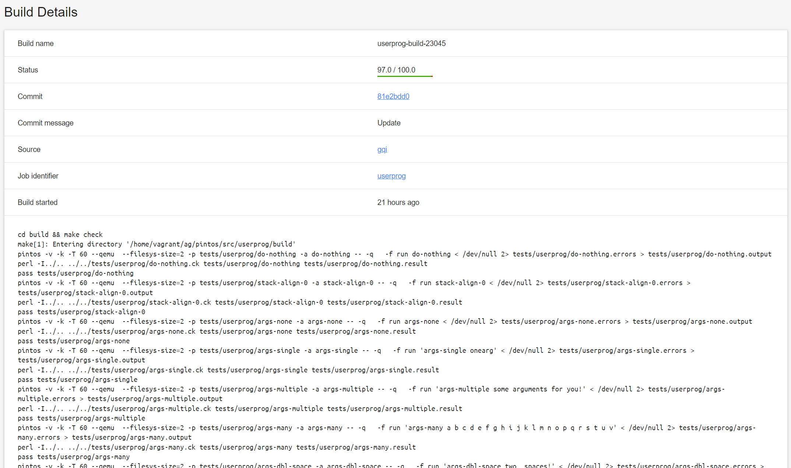

# 操作系统课程设计实验报告

## **实验一 准备开发工具【Pintos Introduction】**

安装C语言开发环境、掌握`git`等网络工程工具的使用

**一. 主要任务**

阅读和分析Linux下的`gcc/make/gdb`等开发工具的使用文档，在自己的机器上配置好C语言开发环境。安装好git客户端工具，注册`gitlab`账号，构建连续集成和连续交付(CI/CD)环境。

重点检查编码、调试、提交等环节的熟练程度。

**二. 实验过程**

1.  **克隆初始仓库**： 首先，通过执行 `git clone` 命令从 Pintos 的初始仓库中克隆代码到本地计算机。这一步骤通常可以通过以下命令完成：
    
    ```
    git clone https://gitlab.etao.net/zjutosd/fa23
    ```
    
2.  克隆完成后，我们将获得 Pintos 源代码的本地副本，可以在本地进行修改和构建。
    
3.  **安装依赖**： 在克隆 Pintos 代码之后，需要安装一系列依赖项，以确保能够成功构建和运行 Pintos。这些依赖项通常包括：
    
    - Git：用于版本控制和管理 Pintos 代码。
    - Clang：用于编译 Pintos 代码，生成可执行文件。
    - QEMU：用于模拟运行操作系统，可以在其中测试和调试 Pintos。
4.  **配置环境**： 在安装依赖项之后，需要对环境进行一些配置，以确保能够顺利构建和运行 Pintos。这些配置通常包括：
    
    - 设置环境变量：将安装的软件路径添加到系统的 PATH 环境变量中，以便系统可以找到相应的可执行文件。
    - 检查版本兼容性：确保安装的软件版本与 Pintos 的要求兼容，特别是对于 Clang 和 QEMU。
5.  **构建项目**： 在配置好环境之后，就可以使用提供的构建脚本或命令来构建 Pintos 项目。通常，构建过程包括以下步骤：
    
    - 使用提供的构建工具或 Makefile 来编译源代码。
    - 检查编译过程中是否有错误或警告，并及时修复。
    - 生成可执行文件或镜像文件，以便在模拟器中进行测试和调试。
6.  **测试和调试**： 构建完成后，可以使用 QEMU 模拟器来运行 Pintos，并进行测试和调试。在模拟器中，可以模拟各种场景和操作系统行为，以验证 Pintos 的正确性和稳定性。同时，还可以使用调试工具来定位和解决可能存在的问题。
    

**三. 实验结果**

由于并没有对代码进行改动，所以，大部分测试点都是failed。



* * *

## **实验二 简单Shell实现**

**一. 主要任务**

设计和实现一个模拟Bash 的shell实现，要求支持`cd`和`pwd`命令，支持程序执行、路径解析、输入/输出的重定向，信号(Signal)处理等功能。

我们添加了两个内置命令：`cd` 和 `pwd`。`cd` 命令用于改变当前工作目录，而 `pwd` 命令则用于打印当前工作目录。

**二. 代码修改**

1.  **添加了执行配置结构体 `Configuration`**：
    
    - 新增了一个结构体 `Configuration`，用于保存执行命令时的参数、重定向信息和管道信息等。
    - 结构体包含了命令的参数列表 `arglist`、输入输出重定向相关信息以及管道相关信息。

```
    typedef struct Configuration {
        //arglist
        char **arglist;

        //redirection
        int redirection;
        int read_file_fd;
        char *read_file_path;
        int write_file_fd;
        char *write_file_path;
        //pipe
        int **pipe;
        int pipe_num, cur_num;
    } Config;
```

2.  **新增了内置命令 `cd` 和 `pwd`**：
    
    - 添加了内置命令 `cd`，用于切换工作目录。

```
    int cmd_cd(unused struct tokens *tokens) {
        const char HOME_PATH[] = "/home/vagrant";
        if (tokens_get_length(tokens) == 1) {
            chdir(HOME_PATH);
        } else if (tokens_get_length(tokens) == 2 && strcmp(tokens_get_token(tokens, 1), "~") == 0) {
            chdir(HOME_PATH);
        } else {
            int failed = chdir(tokens_get_token(tokens, 1));
            if (failed) {
                printf("error\n");
            }
        }
        return 1;
    }
```

- 添加了内置命令 `pwd`，用于打印当前工作目录的路径。

```
    int cmd_pwd(unused struct tokens *tokens) {
        char *buffs = getcwd(NULL, 0);
        printf("%s\n", buffs);
        free(buffs);
        return 1;
    }
```

3.  **新增了程序执行函数 `run_program`**：
    
    - 添加了一个新的函数 `run_program`，用于执行用户输入的命令。
    - 函数根据用户输入的命令参数，执行对应的程序或命令，并支持输入输出重定向和后台运行等功能。

```
    int run_program(struct tokens* tokens) {
        int length = tokens_get_length(tokens);          
        if (length == 0) {
            // user pressed return
            return 0;          
        }
        int run_bg = length > 1 && strcmp(tokens_get_token(tokens, length - 1), "&") == 0;          
        int pid = fork();          
        int status = 0;          
        if (pid == 0) {
            char* args[length + 1];          
            int redirect_stdin = 0, redirect_stdout = 0, num_args = 0;          
            for (int i = 0;           i < length;           i++) {
                char* token = tokens_get_token(tokens, i);          
                if (redirect_stdin) {
                    int fd = open(token, O_RDONLY);          
                    if (redirect(fd, STDIN_FILENO) == -1) {
                        printf("Error with input %s \n", token);          
                        exit(-1);          
                    }
                    redirect_stdin = 0;          
                }
                else if (redirect_stdout) {
                    int fd = creat(token, S_IRUSR | S_IWUSR | S_IRGRP | S_IWGRP | S_IROTH);          
                    if (redirect(fd, STDOUT_FILENO) == -1) {
                        printf("Error with input %s\n", token);          
                        exit(-1);          
                    }
                    redirect_stdout = 0;          
                }
                else if (strcmp(token, "<") == 0) {
                    redirect_stdin = 1;          
                }
                else if (strcmp(token, ">") == 0) {
                    redirect_stdout = 1;          
                }
                else if (!(i == length - 1 && run_bg)) {
                    args[num_args++] = token;          
                }
            }
            args[num_args] = (char*)NULL;          
            char* prog = args[0];          

            // move process to own process group
            setpgid(0, 0);          
            if (!run_bg) {
                // move to foreground if input doesn't end with &
                tcsetpgrp(shell_terminal, getpgrp());          
            }

            //override ignored signal handlers from shell to default signal handlers
            for (int i = 0;           i < sizeof(ignore_signals) / sizeof(int);           i++) {
                signal(ignore_signals[i], SIG_DFL);          
            }

            // execute new program in child process, searching thru path env var if needed
            if (execv(prog, args) == -1 && run_program_thru_path(prog, args) == -1) {
                printf("Error executing program %s\n", prog);          
                exit(-1);          
            }
        }
        else {
            int no_hang = run_bg ? WNOHANG : 0;          
            waitpid(pid, &status, WUNTRACED | no_hang);          
            tcsetpgrp(shell_terminal, shell_pgid);          
        }
        return status;          
    }
```

**三. 实验结果**

实验代码通过了大部分测试样例。



## **实验四** **Pintos用户程序【Pintos** Project 2: User Programs **】**

**一. 主要内容**

阅读分析Pintos源码，实现User Program部分的以下功能：

1、Argument Passing 参数传递

2、Process Control Syscalls 进程控制系统调用

3、File Operating Syscalls 文件操作系统调用

**二. 代码修改**

- Argument Passing 参数传递


- Process Control Syscalls 进程控制系统调用


- File Operating Syscalls 文件操作系统调用


**三. 实验结果**

实验代码通过了大部分测试样例。



* * *

## **实验总结**

**1. 对专业知识基本概念、基本理论和典型方法的理解：**

在进行实验过程中，对于所涉及的专业领域的基本概念、理论和方法需要有一定的理解。这包括对于操作系统、编程语言、数据结构与算法等方面的基本概念的理解，以及对于实验所涉及的具体技术和工具的使用方法的了解。

**2. 怎么建立模型：**

在实验中，建立模型是解决问题的第一步。建立模型涉及到对问题进行抽象和简化，确定问题的关键因素和变量，并将其表示为数学模型、逻辑模型或者计算机模型等形式。建立模型的过程需要考虑到问题的实际情况和所需求解的精度，同时也需要考虑到建模的复杂程度和可行性。

**3. 如何利用基本原理解决复杂工程问题：**

解决复杂工程问题需要运用基本原理和方法，例如通过分析问题的本质和特点，运用已有的理论知识和方法进行分析和求解。同时，还需要结合实际情况和工程实践经验，灵活运用各种工具和技术，找到问题的最优解决方案。

**4. 具有实验方案设计的能力：**

设计实验方案是解决问题的关键步骤之一。具有实验方案设计的能力需要综合考虑问题的背景、目的和要求，确定实验的目标和内容，选择合适的实验方法和工具，设计实验步骤和流程，并对实验结果进行评估和分析。一个好的实验方案能够确保实验的顺利进行和取得有效的结果。

**5. 如何对环境和社会的可持续发展：**

在进行工程实践和解决问题的过程中，需要考虑到对环境和社会的可持续发展。这包括对资源的合理利用和节约、对环境的保护和治理、对社会的责任和贡献等方面的考虑。在设计实验方案和解决工程问题时，应该注重环境友好性和社会责任，尽量减少对环境的影响，促进社会的和谐发展。


